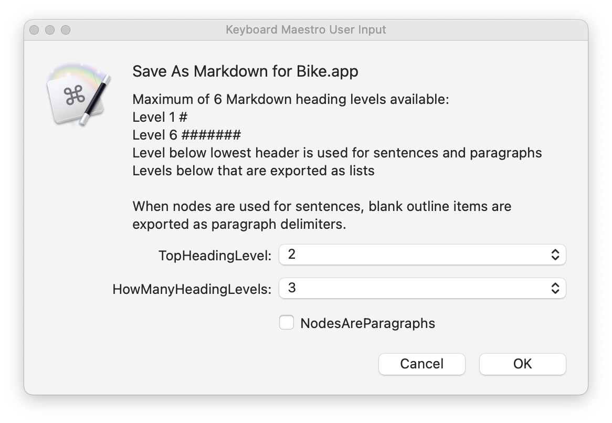

## Draft Demo

### Overview

#### One use of Bike – preparing well structured Markdown documents.

You already can do a lot of different things with Bike, and its ability to read and write outlines in three formats:

- Standard HTML nested lists (Bike's default and link-supporting native format)
- OPML
- Tab-indented indented plain text (Taskpaper's native format)

The flexible and widely-supported HTML nested list format is supported by quite a rich ecosystem of standard tools. Here are a couple of draft demos of using just one of those tools (Apple's built-in `NSXMLDocument` library, accessed through `JavaScript for Automation`) to provide:

- `Copy As Markdown`
- `Save As Markdown`

From a Markdown version of a Bike document, or copied Bike snippet, free tools like [Pandoc](https://pandoc.org/) let us automatically write out other formats, like MS Word `.docx` 

### Save as Markdown, and Copy as Markdown, for Bike (preview) builds

#### JavaScript for Automation is one option

Even where Bike itself is not installed, Bike files can be viewed in browsers, and any standard XML and HTML tools can be used for viewing and converting them. 

In this demo, we are using `JavaScript for Automation`, with Apple's built-in `NSXMLDocument` library, which can read the outline structure of a Bike file directly. 

#### Other options

We could also have written a custom Copy As or Save As using widely-available standard tools like `XSLT` and `XQuery`. 

### Mapping from outline levels to Markdown structure

#### Markdown Heading levels

We can map an outline structure to a Markdown document in any way that we like. In this demo, we are interpreting the top N levels of the outline as Markdown hash headings. 

#### Quote blocks

Any line, at any level in the outline, which starts with `>` is interpreted as the start of a Markdown quote block. The quote block ends at the first blank line that follows it. Here we have two quote blocks: 

> From sounds in the air to inscriptions on the printed page, the material structures of language both reflect, and then systematically transform, out thinking and reasoning about the world.   Andy Clark, *Supersizing the Mind*, 2008 Oxford University Press.

> We were promised bicycles for the mind, but we got aircraft carriers instead.
> [Jonathan Edwards](https://alarmingdevelopment.org/), quoted by @jesse

#### Code blocks

Any line, at any indent level, which starts with three backticks is interpreted as marking the start or end of a code-block. The top-level Bike-reading function in this draft JavaScript demo is: 

```javascript
// treeFromBikeStringLR :: Bike String ->
// Either String [Tree String]
const treeFromBikeStringLR = s => {
    const
        error = $(),
        node = $.NSXMLDocument.alloc
        .initWithXMLStringOptionsError(
            s, 0, error
        );
    return node.isNil() ? (() => {
        const
            problem = ObjC.unwrap(
                error.localizedDescription
            );
        return Left(
            `Not parseable as Bike:\n\n${problem}`
        );
    })() : treeFromBikeXMLNodeLR(node);
};
```

#### Script options

Number of heading levels ?

- How many of the top outline levels do we want to use for headings ? (6 is the maximum)

```
const howManyHeadingLevels = 1;
```

Top heading level ?

- Which MD heading level do we want to start the document with ?
- We might want to reserve `#` for example, and skip straight to `##`.
- The lowest available Markdown heading is `######`

```
const startHeadingLevel = 2;
```

Outline items as paragraphs or sentences ?

- Markdown expects paragraphs to be separated by a blank line (two `\n` characters).
- Lines separated only by a single `\n` in Markdown are run together as continuous sentences inside a paragraph, until the next blank line.

- If we set the option `nodesAreParagraphs` to **true**, the export script adds a blank line after every outline item, turning each item into a Markdown paragraph on its own.
- If we set `nodesAreParagraphs` to **false**, then we can add our own blank lines in the outline, and each series of outline items can be run together, by default, into a paragraph, until a blank line is found.

```
const nodesAreParagraphs = true;
```

### Versions of the script

#### Each of these two demos is provided in two flavours:

A stand-alone script, which you could attach to a keyboard shortcut with something like [FastScripts](https://redsweater.com/fastscripts/), and a [Keyboard Maestro](https://www.keyboardmaestro.com/main/) version, which supports an options dialog for the Save As operation.  

#### Copy Bike as Markdown

Select some lines in Bike, and run the script to copy the selection as Markdown.

- [CopyAsMarkdownForBike.zip](file:///Users/robintrew/Code/bike/CopyAsMarkdownForBike.zip)

#### Save Bike as Markdown

With a Bike document open:

- Run the script
    - [SaveAsMarkdownForBike.zip](./SaveAsMarkdownForBike.zip)
- Confirm the formatting options if you are using the Keyboard Maestro version
- and choose an output file name

### Previewing Markdown

#### Marked

You can preview and print from Markdown texts and clipboards, applying different CSS stylesheets, with [Marked 2](https://marked2app.com/). 

### Converting Markdown to MS Word `.docx`

#### Pandoc

The free [Pandoc](https://pandoc.org/) tool, which can be run from the command line, and included in script and macro flows, provides conversion from Markdown to .docx and a number of other formats. 

